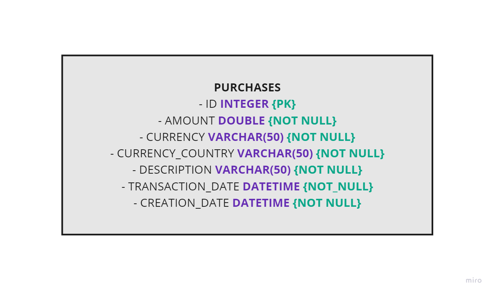

# Purchase Microservice

The Purchase Microservice is a Java-based application designed to fulfill the requirements outlined in the product
brief. This service allows the storage and retrieval of purchase transactions, including the ability to convert
purchase amounts from USD to different currencies. The currency conversion is based on exchange rates that come
from the United States
Government's [Treasury Reporting Rates of Exchange API](https://fiscaldata.treasury.gov/datasets/treasury-reporting-rates-exchange/treasury-reporting-rates-of-exchange).

## Requirements

### 1. Store Purchase Transactions

The application must store a purchase transaction with a description, transaction date, and a purchase amount in United
States dollars. The fields have the following requirements:

- **Description:** must not exceed 50 characters
- **Transaction date:** must be a valid date format
- **Purchase amount:** must be a valid positive amount rounded to the nearest cent
- **Unique identifier:** must uniquely identify the purchase

### 2. Retrieve and Convert Purchases to Different Currencies

The application should retrieve and convert previously stored purchase transactions into currencies supported by the
[Treasury Reporting Rates of Exchange API](https://fiscaldata.treasury.gov/datasets/treasury-reporting-rates-exchange/treasury-reporting-rates-of-exchange).
This conversion is based on the exchange rate active on the date of the original purchase. The retrieved purchase
information should include the identifier, description, transaction date, original US dollar purchase amount, exchange
rate used, and the converted amount in the specified currency.

For currency conversion:

- The application is not required to match exact dates but should use a currency conversion rate less than or equal to
  the purchase date from within the last 6 months.
- If no currency conversion rate is available within 6 months before or on the purchase date, the application should
  return an error indicating the inability to convert to the target currency.
- The converted purchase amount to the target currency should be rounded to two decimal places (i.e., cents).

## Technical Implementation and Decisions

### Defining Project Scope and Microservice Domain

Constructing a complex architecture without a clear objective may prove counterproductive. The chosen architecture is
influenced by interconnected software components, the potential for synchronous or asynchronous processing, and other
relevant factors.

Selecting a microservice domain name requires careful consideration. Opting for a generic domain like "TRANSACTIONS" may
encounter challenges due to the high volume of API calls it receives as a central component. Storing unnecessary
information can potentially impede performance and scalability, leading to the need for refactoring in what should be a
straightforward process. This may result in a confusing and unnecessarily complex API.

On the other hand, a more specific domain like "PURCHASES," representing a minor business unit, facilitates easier
horizontal scalability. It avoids unnecessary features associated with an overly generic domain, streamlining
application performance, reducing development time, and minimizing the quantity of refactored code in the future.
This approach ensures a more efficient, focused, and user-friendly API.

### Database Modeling

I decided to use a relational database because the information doesn’t have a dynamic structure and probably will not
change that much in the future. The microservice has its own database that contains the following objects:



### General Definitions

- **Bean Validation:** Implemented thorough request validation for essential fields, reinforcing data integrity.
- **Communication Approach:** Opted for REST-based communication due to its rapid implementation, allowing for a quick
  assessment of the application's alignment with requirements. I thought about using Apache Kafka, but depending on the
  objective of the product and the quantity of calls to this service, it would not be necessary. If validation,
  processing, or capturing transactions involve multiple steps, and storing purchases is a time-consuming process that
  integrates with other services, opting for asynchronous communication can offer significant advantages.
- **Precision Handling:** Utilized `BigDecimal` for fields and calculations requiring precision, ensuring accurate
  representation.
- **Database Scripts Versioning:** Employed Flyway for effective versioning of database scripts.
- **Object Conversions:** Implemented object conversions seamlessly using Mapstruct, enhancing efficiency in data
  transformations.
- **Logging and Error Handling:** Logs and descriptive error response messages were added to make it easier to
  understand possible problems.

### Definitions - Storing Purchase Transactions

- **Unique Identifier:** Currently, the purchase unique identifier is the numeric ID generated by the table's primary
  key sequence. At this moment, using a UUID as the unique identifier could just add an unnecessary field that would not
  be used in the future.
- **Handling Multiple Currencies:** To enable this microservice to handle and store diverse purchase currencies, I opted
  to include both the currency and currency country in the table.
- **Temporary Currency Enumeration:** I introduced a temporary currency enum to delimit the available currencies in the
  request. However, looking ahead, it’s a good idea to create a dynamic list or endpoint for the frontend. This can be
  populated with information sourced from the database, libraries or other APIs, such as the US Treasury, in the future.

### Definitions - Retrieval and Currency Conversion of Purchases

- **API Filters Usage:** I employed the filters provided by the Treasury Reporting Rates of Exchange API to establish
  ranges and filter information based on currency and country.
- **Effective Date Field:** The `effective_date` field is utilized to filter the Treasury Reporting Rates of Exchange
  API. This field is crucial as it determines the duration until which the exchange rate value remains valid. In
  contrast, the `record_date` appears to represent the creation date, and while it may coincide with the effective date,
  there are instances where the information differs.
- **Currency Differentiation:** Given the presence of distinct currencies like the Canadian dollar and Australian
  dollar, incorporating the currency country became essential for a more accurate conversion. This distinction is
  necessary because the exchange rates for the dollars of these countries can vary.

### Potential Challenges and Solutions

My experience in the financial and transactions domain has provided valuable insights into potential challenges:

- **Duplicated Transactions:** The current system lacks a definitive unique identifier to eliminate duplicated
  transactions. To enhance identification, consider leveraging key information such as payment type, customer
  identification, sales point identification, and other transaction details.
- **Performance Issues:** Potential concerns may arise regarding database performance due to a high volume of calls and
  transactions. Additionally, service performance issues may occur if the demand on the system is substantial. In these
  cases, adopting an event-based architecture, employing caching solutions, and optimizing database indices can
  effectively address performance concerns.
- **Observability Challenges:** In a complex transaction ecosystem, observability becomes crucial. Difficulty in
  identifying and detecting errors necessitates a robust observability system to enhance error detection and
  troubleshooting.
- **Reprocessing Transactions:** Establishing a structured mechanism to facilitate transaction reprocessing is
  essential. Automating the reprocessing of failed transactions periodically ensures that errors are addressed
  efficiently over time.

### Future Roadmap and Potential Enhancements

- **Migration from H2 to a Persistent Database:** Transition from H2, a temporary in-memory database, to a more robust
  and persistent database solution for improved data durability and performance.
- **Authentication Enhancement with Spring Security:** Integrate Spring Security to fortify the authentication
  mechanisms and bolster the application's security posture.
- **CI/CD Pipeline Implementation:** Establish a Continuous Integration/Continuous Deployment (CI/CD) pipeline to
  automate the software delivery process, ensuring more efficient development and deployment cycles.
- **Infrastructure Configuration with Terraform:** Implement Terraform to streamline and automate the configuration of
  the infrastructure, fostering better maintainability.
- **Application Deployment on AWS:** Transfer the application to Amazon Web Services (AWS) for enhanced scalability and
  reliability.
- **Internationalization of Messages:** Implement message internationalization to enhance the application's
  accessibility for a diverse user base, allowing for a seamless experience across different languages.
- **UnitedStatesTreasury Client Library Creation:** Put the UnitedStatesTreasuryClient into a library to facilitate
  integration and usage.
- **Event-Driven Architecture Implementation:** Consider adopting an event-driven architecture to maintain consistency,
  enable processing from other services, support reprocessing, parallel risk analysis, alerts, and automated email
  messages.
- **API Calls Caching:** Introduce caching for API calls to the UnitedStatesTreasuryClient to optimize performance.
- **Currency Microservice Creation:** Depending on the need, explore the creation of a Currency Microservice to enable
  currency conversion beyond USD.

## Running the Application

### Requirements

- Install Docker
- Install Docker Compose
- Install JDK 17 (Optional)
- Install Maven (Optional)

### Using Docker

To run the code, it is just use the Docker Compose to build and run the application container:

```bash
$ docker-compose up
```

If it is necessary to rebuild the project, the flags `--build --force-recreate --no-deps` can be used after the
`docker-compose up` command.

### Using IDEs

The newer Spring Boot versions require at least the JDK 17, so it will be necessary for you to install and configure the
Java 17 version if you prefer to run this project using an IDE or the terminal. The following command can be used:

```bash
$ mvn spring-boot:run -Dspring-boot.run.profiles=dev
```

> After running the application, it is possible to access the API documentation to see the available endpoints and test
> the application: http://localhost:8080/swagger-ui/index.html

> The access to the H2 database console can be done by the http://localhost:8080/h2-console URL. Use the following
> credentials:
> - User Name: sa
> - Password: password